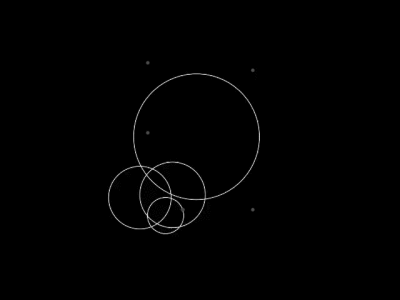

# Epicycle Drawer

## Introduction
This is a tool that takes in a drawing as input from the user and draws it using epicycles.
#### What are epicycles and epicycle drawings?
An epicycle is a circle, with a small radius, whose center revolves on the circumference of another circle of larger radius. The path traced by a point on the smaller circle can be manipulated to form various different shapes. This is demonstrated in the image below.
  

