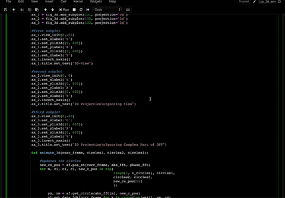
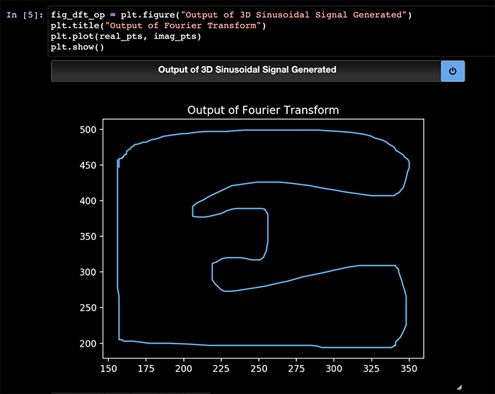
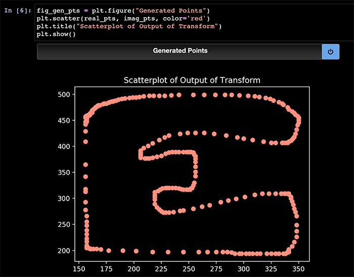
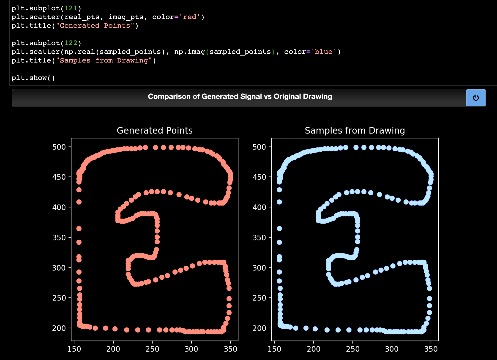

# Epicycle Drawer

## Introduction
This is a tool that takes in a drawing as input from the user and draws it using epicycles.
### What are epicycles and epicycle drawings?
An epicycle is a circle, with a small radius, whose center revolves on the circumference of another circle of larger radius. The path traced by a point on the smaller circle can be manipulated to form various different shapes. This is demonstrated in the image below.
<br><br>

<br>
Multiple circles can be arranged and made to rotate at different speeds and in different phases. The path of a point on the last such circle can be traced, to create a drawing. The aim of this project is to take a desired drawing as input, and arrange circles in such a way that the path of a point on the last circle results in the desired drawing.

## Example

### Input

### Epicycle Drawing

### Plots
#### 3D Plot of Various Angles of the Drawing

#### Output from Fourier Transform

#### Scatterplot of Values from Fourier Transform

#### Comparison of Original Sample Points & Points from Fourier Transform


## Usage

Clone this repo into a local directory.

It is recommended to run this project in a virtual environment, running Python 3(preferably Python 3.6).
Install and create the environment using
```shell
  pip install virtualenv
  virtualenv -p python3.6 newvenv
```
Activate it using
```shell
  source newvenv/bin/activate
```
Install the necessary packages with
```shell
  pip install -r requirements.txt
```
* Run the notebook with ```jupyter notebook``` <br>
* The settings cell can be changed as required. <br>
* You can either run the cells manually(use `Shift+Enter` to run a cell and move to the next one) or use the 'Run All Cells' option. <br>
* When the drawing board appears, draw your figure(preferably a continuous figure/shape, which while can be drawn with multiple strokes, should be possible to draw without lifting a pen. This ensures best results, however, the drawer works otherwise too(but is forced to add extra lines in regions where the pen would be lifted). <br>
* Close the drawing board window when you are done drawing and continue executing the following cells
* To run the program again, use the `Restart and Clear Output` option.

###### NOTE
If the `save_anim` option is set to 1, then make sure to allow time for the animation to be saved, before running any other cells.

## To-Do
* [ ] Allow user to trace from a bg image(probably with some point assistance)
* [ ] Generate epicycles for pre-existing image
  * [x] Load image and get contours
  * [ ] Get sample points in order of appearance

## Ideas & Software Used
* Python 
* Fourier Transforms

## Author(s)
[Ahish Deshpande](https://github.com/Ahish9009)
